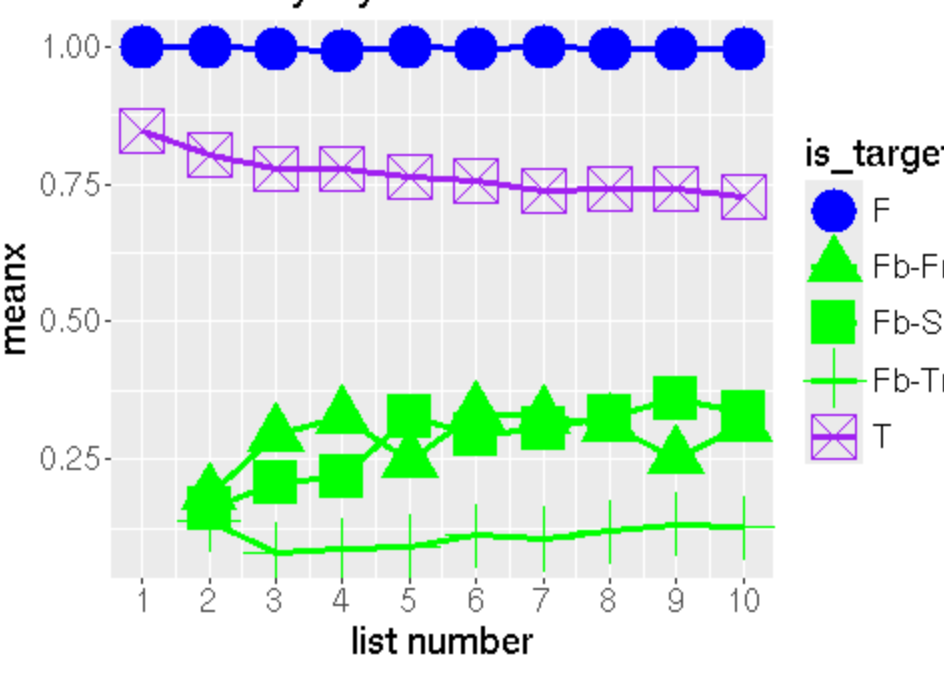
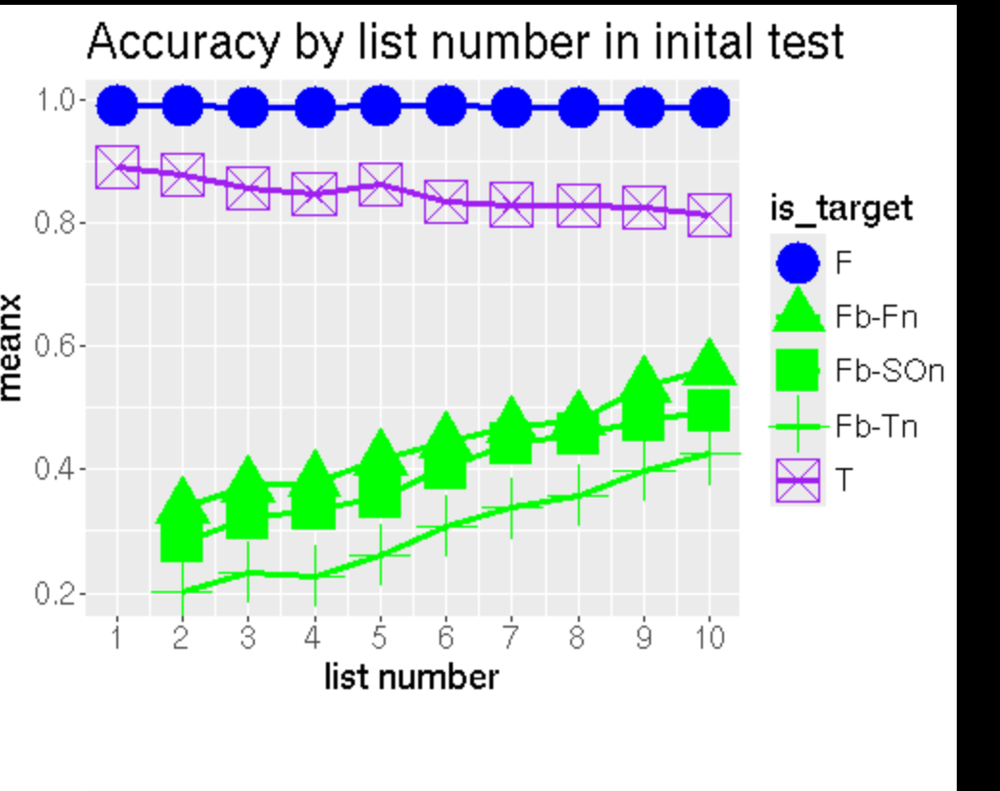

- test my own thought; see what if all UC; + small C:

alomost activating many last traces; no difference in fucusing of current list; 
ratio_unchanging_to_itself_init = LinRange(1, 1, n_lists) # if use no unchanging
ratio_changing_to_itself_init = LinRange(0.3, 0.3, n_lists) # if use no unchanging
=> see if purely N activates goes up (from n-2 lists), will it pred T fall AND Fb CR INCREASE?

I think im correct; T down and CR Fb up 

2. 
u_star_context=vcat(0.05, ones(n_lists-1)*0.05)#CHANGED
n_between_listchange = 12; #5;15; #CHANGED

context_tau = LinRange(100, 100, n_lists) ##CHANGED 1000#foil odds should lower than this  

criterion_initial = LinRange(5, 3, n_probes); #CHANGED

