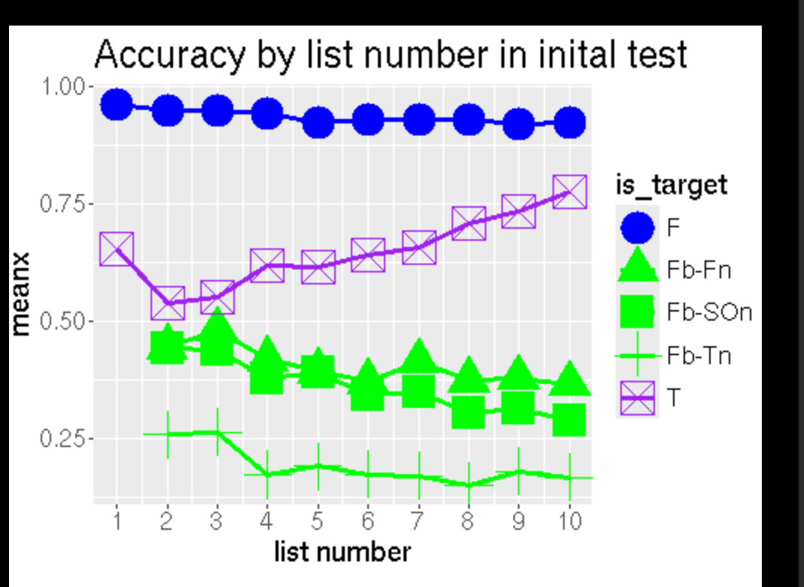
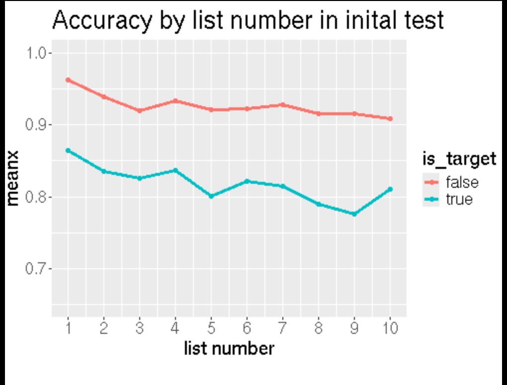
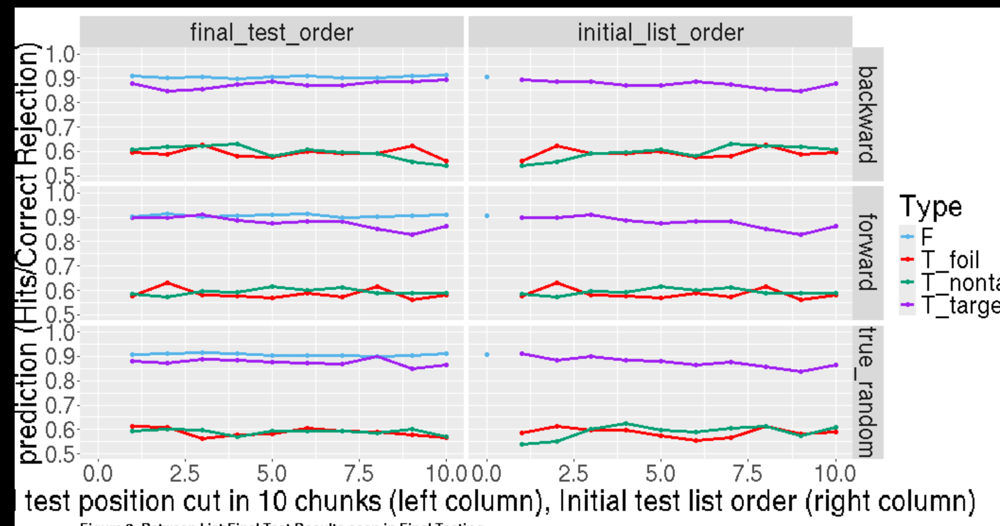
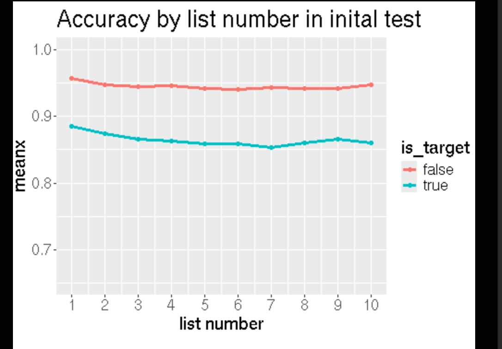
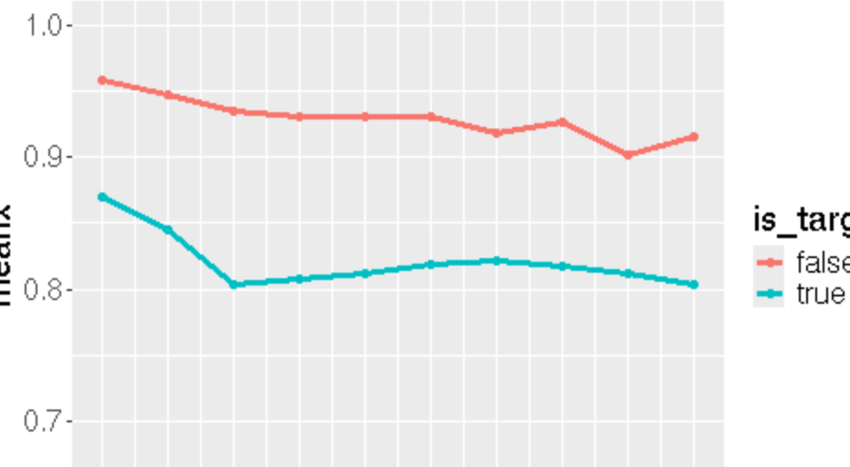

1. E3
   1. ratio_unchanging_to_itself_init = LinRange(0.0, 0.2, n_lists) # if use no unchanging;
   2. ratio_changing_to_itself_init = LinRange(0.5,1, n_lists) 
   3. context_tau = LinRange(100, 10000, n_lists) 
   4. 

1. E1

-- previously , I had this:

-- !! Okok, I wasn't wrong in likelihood fucntion in adding the chunking image_context...
i don't know what im doing today; stumpling around these issues... Feeling like that I am not focused enough today.... My mind might not be working well today.
 

uh.. whats the current mechianism for list 1 drop to list 2now?? if i don't have the special save..??